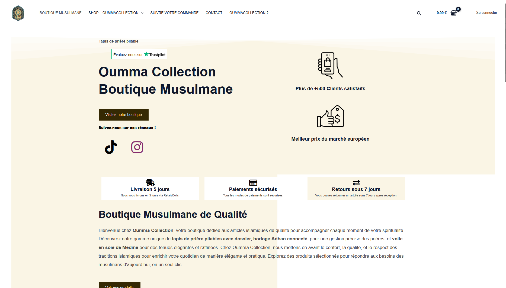
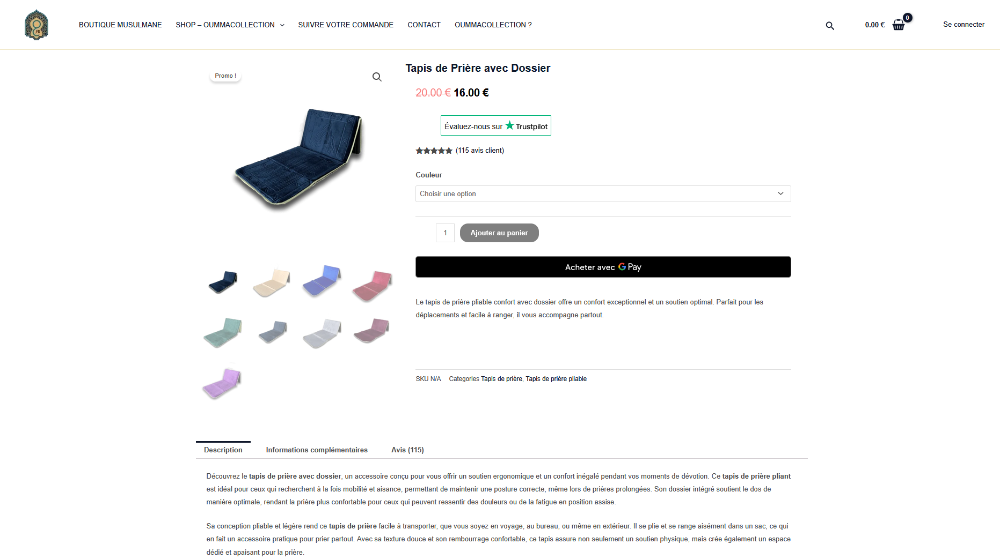
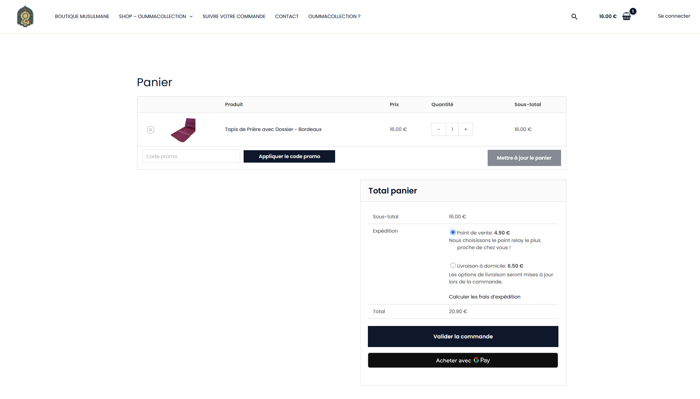

## Oummacollection.fr

🔗 Site client (public) : https://oummacollection.fr

Plateforme e-commerce spécialisée dans un **catalogue volontairement restreint
(3 produits stratégiques)** à **fort volume de recherche** et **forte
saisonnalité**, nécessitant une **excellence technique**, une **performance
irréprochable** et une **stratégie marketing multi-canal**.

---

## 🖼️ Aperçu de la boutique

> Captures issues de l’interface publique  
> (aucune donnée sensible ou accès administrateur exposé)

---

## 1️⃣ Analyse du Besoin

Oummacollection opère sur un modèle e-commerce particulier :

- Catalogue très limité mais stratégique
- Produits à **forte intention d’achat**
- Ventes concentrées sur des **périodes clés**
  (Ramadan, Aïd, périodes de cadeaux)
- Forte dépendance à la **visibilité en ligne**

Les problématiques identifiées étaient :

- ❌ Performances web insuffisantes pour le SEO
- ❌ UI trop lourde pour une boutique saisonnière
- ❌ Faible structuration sémantique des pages produits
- ❌ Absence de stratégie d’acquisition coordonnée (SEO / SEA / Social)

L’enjeu principal était donc :
👉 **maximiser la visibilité et la conversion pendant les pics saisonniers**.

---

## 2️⃣ Solution Proposée

Développement et optimisation d’une **plateforme e-commerce orientée performance
et acquisition**, reposant sur :

- Un **développement e-commerce optimisé**
- Une **UI volontairement légère**
- Une **architecture pensée pour les Core Web Vitals**
- Une **stratégie SEO avancée**
- Une **stratégie marketing multi-canal ciblée**

---

## 3️⃣ Développement E-commerce & Performance

### 🛒 E-commerce
- Pages produits conçues comme de véritables landing pages
- Tunnel d’achat fluide et sans friction
- Structure simple et robuste

### ⚡ UI & Core Web Vitals
- Design épuré et faiblement lourd
- Réduction des scripts non essentiels
- Optimisation du chargement des ressources critiques
- Images compressées et formats modernes
- Performance mobile prioritaire

Objectif :
👉 chargement rapide  
👉 meilleure expérience utilisateur  
👉 amélioration du taux de conversion  

---

## 4️⃣ SEO – Axe Central du Projet

### 🔍 SEO Sémantique
- Recherche approfondie de mots-clés par produit
- Structuration des pages par intention de recherche
- Contenus riches, orientés conversion
- Maillage interne ciblé

### 📈 SEO Technique
- Structure HTML sémantique
- URLs propres et lisibles
- Optimisation mobile-first
- Base technique compatible Core Web Vitals

### 📅 SEO Saisonnière
- Anticipation des périodes clés
- Optimisation des contenus avant les pics
- Mise à jour des titles et meta selon la saison

---

## 5️⃣ Stratégie d’Acquisition & Marketing

### 🎯 SEA (Google Ads)
- Activation ciblée sur les périodes clés
- Search & Shopping Ads
- Remarketing des visiteurs non convertis
- Optimisation du ROI

### 📱 Réseaux Sociaux
- Campagnes Social Ads (Instagram, Facebook, TikTok)
- Contenus courts et adaptés aux périodes religieuses
- Retargeting multi-canal

### 🤝 Influence & Communauté
- Collaboration avec micro-influenceurs
- Partenariats avec prédicateurs et acteurs communautaires
- Présence lors d’événements religieux et communautaires
- Actions locales (flyers, QR codes, offres dédiées)

---

## 6️⃣ Résultats & Valeur Apportée

- ✅ Plateforme e-commerce performante et stable
- ✅ Excellente expérience mobile
- ✅ Meilleure visibilité organique
- ✅ Conversion optimisée sur périodes clés
- ✅ Stratégie d’acquisition maîtrisée
- ✅ Image de marque crédible et cohérente

---

## 7️⃣ Scalabilité & Évolutivité

La plateforme est conçue pour :
- Ajouter de nouveaux produits stratégiques
- Déployer de nouvelles campagnes saisonnières
- Étendre la stratégie marketing
- Adapter les performances à la montée en charge

---

## 📄 Documentation Complémentaire

- [Architecture & développement e-commerce](docs/architecture/overview.md)
- [Stratégie SEO avancée](docs/architecture/seo-strategy.md)
- [Stratégie marketing & acquisition](docs/architecture/acquisition-strategy.md)

---

## 🔒 Confidentialité

Ce repository présente la solution d’un point de vue
fonctionnel, technique et stratégique.
Les données sensibles, accès administrateurs et règles
commerciales ne sont pas exposés.
